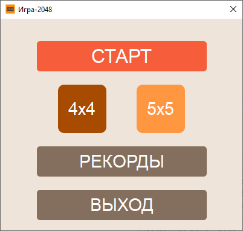
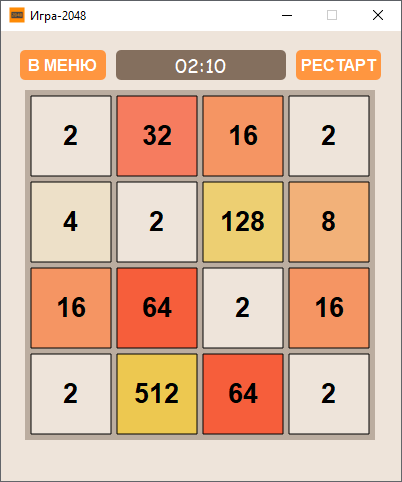
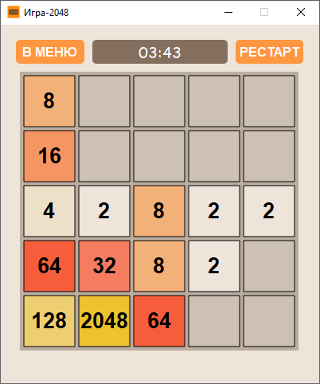

# Game-2048

Game-2048 — это современная реализация классической головоломки 2048, разработанная на C++ с использованием фреймворка Qt. Игрокам предстоит объединять плитки с числами на игровом поле, чтобы достичь заветной плитки 2048. Игра поддерживает поля 4x4 и 5x5, предлагая разнообразный игровой процесс. Интуитивный интерфейс, стильный дизайн и система рекордов делают игру увлекательной для любителей головоломок.
Особенности:

- Два размера поля: Играйте на полях 4x4 или 5x5;
- Система рекордов: Отслеживание лучших результатов и времени для обоих размеров поля с подсветкой победных игр (достижение 2048);
- Интуитивный интерфейс: Чистый и привлекательный дизайн с цветовой палитрой, вдохновлённой классической 2048;
- Сохранение данных: Рекорды и прогресс сохраняются в файл stats.txt;
- Интерактивные диалоги: Подтверждение действий (выход, рестарт) с локализованными подсказками на русском языке.


## Скриншоты


Главное меню:



Игра 4x4:



Игра 5x5:




## Установка


### Требования

- Qt 6.4.2 или новее (протестировано с MinGW_64);
- CMake 3.16 или новее;
- Компилятор C++: MinGW-w64 (для Windows).


### Инструкция

Клонируйте репозиторий:\
git clone https://github.com/<ваш-username>/Game-2048.git
cd Game-2048


Настройте Qt:\
Убедитесь, что Qt установлен и добавлен в PATH.
Пример для Windows (замените путь и версию Qt при необходимости):
`
set PATH=%PATH%;C:\Qt\6.4.2\mingw_64\bin
`

Соберите проект:
```
mkdir build
cd build
cmake ..
cmake --build . --config Release
```

Запустите игру:
```
.\Release\Game2048.exe
```


### Использование

#### Главное меню:
- "Начать": Запускает игру (4x4 или 5x5);
- "Рекорды": Показывает таблицу результатов;
- "Выход": Закрывает приложение.


#### Игровой процесс:
- Используйте стрелки или WASD для перемещения плиток и объединения одинаковых чисел;
- Достигните 2048 для победы (появляется диалог победы);
- Игра заканчивается, если ходы невозможны (появляется диалог окончания).


#### Рекорды:
- Просматривайте результаты в таблице с колонками: 4x4 Счёт, 4x4 Время, 5x5 Счёт, 5x5 Время;
- Победные игры подсвечиваются желтым цветом.


### Зависимости

- Qt 6.4.2: для UI и логики;
- CMake: для сборки проекта;
- C++11: для кода.


### Сборка и развертывание

Для Windows используйте windeployqt для создания переносимой версии:
```
cd build\Release
<Path to Qt>\6.4.2\mingw_64\bin\windeployqt --no-opengl-sw --no-system-d3d-compiler Game2048.exe
```
Релиз v1.0.0 доступен в Releases.

### Лицензия

Проект распространяется под лицензией MIT (см. файл [LICENSE](LICENSE)). Использует Qt 6.4.2 под LGPL v3, текст лицензии в бинарном архиве (LICENSE.Qt.txt).
